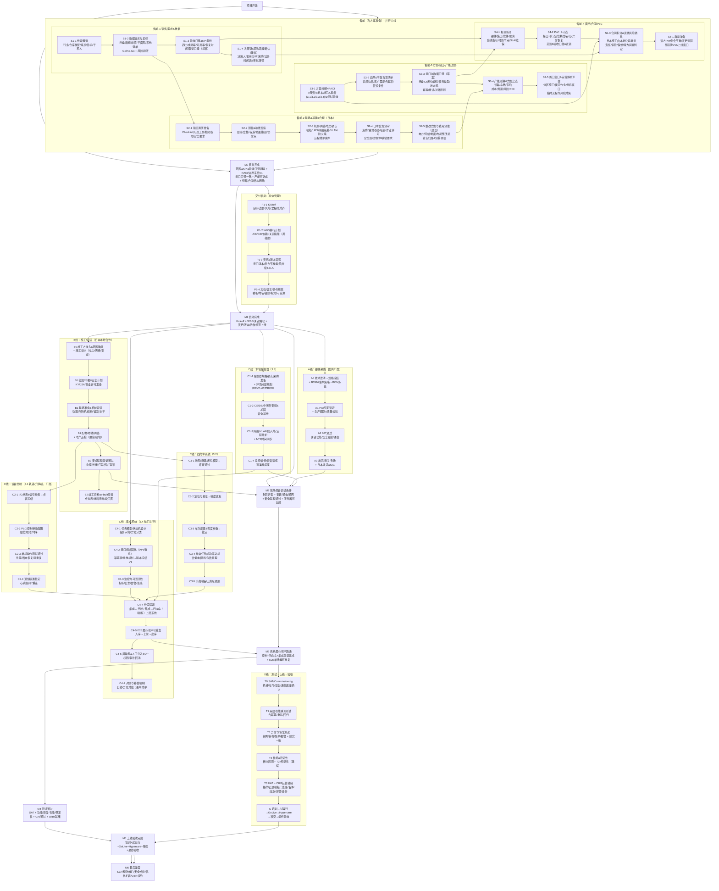

```mermaid
flowchart TB
START["项目开始"]

%% =========================================================
%% 主干里程碑（上层一眼看懂）
%% =========================================================
START --> M0["M0 售前完成<br/>范围&KPI&验收口径初版 + RACI/边界冻结V1<br/>接口口径一致 + 产能可达成 + 预算/合同结构明确"]
M0 --> M1["M1 启动完成<br/>Kickoff + WBS/关键路径 + 变更/版本/协作规范上线"]
M1 --> M2["M2 现场具备调试条件<br/>到货齐套 + 安装/通电/通网 + 安全联锁通过 + 服务器可运维"]
M2 --> M3["M3 系统最小闭环跑通<br/>控制+四向车+集成联调完成 + E2E单托盘可重复"]
M3 --> M4["M4 测试通过<br/>SAT + 功能/恢复/性能/稳定性 + UAT通过 + ORR就绪"]
M4 --> M5["M5 上线验收完成<br/>培训+试运行+GoLive+Hypercare+移交+最终验收"]
M5 --> M6["M6 售后运营<br/>SLA/预防维护/安全点检/优化扩容/QBR续约"]

%% =========================================================
%% 售前（并行主线展开）
%% =========================================================
subgraph PREALL["售前（含方案准备）- 并行主线"]
direction LR

%% ---- P1 销售/需求&数据 ----
subgraph P1["售前-1 销售/需求&数据"]
direction TB
P1_1["S1-1 线索澄清<br/>行业/仓库类型/痛点/目标/干系人"]
P1_2["S1-2 数据请求与初筛<br/>托盘/箱规/峰值/平面图/系统清单<br/>Go/No-Go + 风险初版"]
P1_3["S1-3 验收口径&KPI基线<br/>吞吐/成功率/可用率/恢复时间/取证口径（初稿）"]
P1_4["S1-4 决策链&采购路径确认（建议）<br/>决策人/使用方/IT/采购/法务<br/>时间表&审批路径"]
P1_1 --> P1_2 --> P1_3 --> P1_4
end

%% ---- P2 现场&基建&合规 ----
subgraph P2["售前-2 现场&基建&合规（日本）"]
direction TB
P2_1["S2-1 现场调研准备<br/>Checklist/人员工具/拍照权限/安全要求"]
P2_2["S2-2 测量&动线观察<br/>层高/立柱/巷道/地面/瓶颈/异常点"]
P2_3["S2-3 机房/网络/电力确认<br/>机柜/UPS/网络拓扑/VLAN/防火墙<br/>远程维护条件"]
P2_4["S2-4 日本合规预审<br/>消防/避难动线/噪音/作业许可<br/>安全围栏/急停/联锁要求"]
P2_5["S2-5 整改方案与费用预估（建议）<br/>电力/网络/地面/布局整改项<br/>责任归属&预算预估"]
P2_1 --> P2_2 --> P2_3 --> P2_4 --> P2_5
end

%% ---- P3 方案&接口&产能 ----
subgraph P3["售前-3 方案/接口/产能/边界"]
direction TB
P3_1["S3-1 方案分解+RACI<br/>A硬件/B日本施工/C软件(3.1/3.2/3.3/3.4)/D测试验收"]
P3_2["S3-2 边界&不包含项清单<br/>资质边界/客户需配合事项/假设条件"]
P3_3["S3-3 接口与数据口径（草案）<br/>托盘ID/库位编码/任务类型/状态码<br/>幂等/重试/对账原则"]
P3_4["S3-4 产能测算&方案比选<br/>设备/车数/节拍<br/>成本/周期/风险/ROI"]
P3_5["S3-5 施工窗口&运营影响评估<br/>分区施工/夜间作业/停机窗口<br/>临时流程与风险对策"]
P3_1 --> P3_2 --> P3_3 --> P3_4 --> P3_5
end

%% ---- P4 商务&合同&PoC ----
subgraph P4["售前-4 商务/合同/PoC"]
direction TB
P4_1["S4-1 报价拆分<br/>硬件/施工/软件/服务<br/>验收指标/付款节点/SLA/维保"]
P4_2["S4-2 PoC（可选）<br/>接口可行/定位精度/吞吐/异常恢复<br/>范围&验收口径&资源"]
P4_3["S4-3 合同拆分&资质风险确认<br/>日本施工由本地公司承接<br/>责任/保险/保修/跨方问题判定"]
P4_4["S5-1 启动准备<br/>双方PM/例会节奏/变更流程<br/>里程碑V1&上线窗口"]
P4_1 --> P4_2 --> P4_3 --> P4_4
end

end

START --> PREALL --> M0

%% =========================================================
%% 售前阶段关键依赖（让并行“能收敛”）
%% =========================================================
P1_2 --> P2_1
P2_5 --> P3_4
P1_3 --> P4_1
P3_3 --> P4_1
P3_1 --> P4_3
P1_4 --> P4_3

%% =========================================================
%% 交付启动（总体管理）
%% =========================================================
subgraph PMO["交付启动（总体管理）"]
direction TB
PM1["P1-1 Kickoff<br/>目标/边界/风险/里程碑对齐"]
PM2["P1-2 WBS并行计划<br/>A/B/C/D依赖+关键路径（周粒度）"]
PM3["P1-3 变更&版本管理<br/>接口版本/发布节奏/缺陷分级&SLA"]
PM4["P1-4 文档/语言/协作规范<br/>模板/命名/台账/权限/可追溯"]
PM1 --> PM2 --> PM3 --> PM4
end
M0 --> PMO --> M1

%% =========================================================
%% 交付实施主线（A/B/C/D）- 与上一版一致
%% =========================================================
subgraph AHW["A线：硬件采购（国内厂商）"]
direction TB
A1["A0 技术澄清→规格冻结<br/>+ BOM&备件策略→BOM冻结"]
A2["A1 PO/交期锁定<br/>+ 生产跟踪&质量检验"]
A3["A2 FAT通过<br/>关键功能/安全互锁/通信"]
A4["A3 出货/清关/到场<br/>+ 日本收货&IQC"]
A1 --> A2 --> A3 --> A4
end

subgraph BCON["B线：施工/安装（日本本地合作）"]
direction TB
B1["B0 施工方准入&范围确认<br/>+ 施工设计（电力/网络/安全）"]
B2["B0 合规/申报&安全计划<br/>KY/JSA/作业许可准备"]
B3["B1 现场准备&机械安装<br/>轨道/升降机/结构/锚固/水平"]
B4["B1 配电/布线/网络<br/>+ 电气点检（绝缘/接地）"]
B5["B2 安全联锁验证通过<br/>急停/光栅/门禁/围栏联锁"]
B6["B2 竣工资料as-built交接<br/>点位表/材料清单/竣工图"]
B1 --> B2 --> B3 --> B4 --> B5 --> B6
end

subgraph CENV["C线：本地服务器（3.3）"]
direction TB
E1["C1-1 服务器规格确认/采购准备<br/>+ 环境分层规划（DEV/UAT/PROD）"]
E2["C1-2 OS/DB/中间件安装&加固<br/>安全基线"]
E3["C1-3 网络/VLAN/防火墙/远程维护<br/>+ NTP时间同步"]
E4["C1-4 监控/备份/恢复演练<br/>可运维底座"]
E1 --> E2 --> E3 --> E4
end

subgraph CTRL["C线：设备控制（3.1 轨道/升降机，厂商）"]
direction TB
C1["C2-1 I/O点表&信号映射→点表冻结"]
C2["C2-2 PLC/控制参数配置<br/>限位/校准/时序"]
C3["C2-3 单机动作测试通过<br/>急停/断电恢复/可重复"]
C4["C2-4 通信联通稳定<br/>心跳/超时/重连"]
C1 --> C2 --> C3 --> C4
end

subgraph SHUTTLE["C线：四向车系统（3.2）"]
direction TB
S1["C3-1 地图/巷道/库位模型→评审通过"]
S2["C3-2 定位与校准→精度达标"]
S3["C3-3 车队配置&调度参数→稳定"]
S4["C3-4 单体任务成功率达标<br/>含低电/阻挡/失败处理"]
S5["C3-5 小规模吞吐满足预期"]
S1 --> S2 --> S3 --> S4 --> S5
end

subgraph INTG["C线：集成系统（3.4 你们主导）"]
direction TB
I1["C4-1 任务模型/状态机设计<br/>任务字典/异常分类"]
I2["C4-2 接口规格固化（API/消息）<br/>幂等键/重放机制→版本冻结V1"]
I3["C4-3 监控与可观测性<br/>指标/日志/告警/值班"]
I4["C4-4 分段联调<br/>集成↔控制 / 集成↔四向车 /（如有）上层系统"]
I5["C4-5 E2E最小闭环可重复<br/>入库→上架→出库"]
I6["C4-6 异常库&人工介入SOP<br/>权限/审计/回退"]
I7["C4-7 对账与补偿机制<br/>日终/异常对账；丢单防护"]
I1 --> I2 --> I3 --> I4 --> I5 --> I6 --> I7
end

subgraph TEST["D线：测试→上线→验收"]
direction TB
T1["T0 SAT/Commissioning<br/>机械/电气/安全/通信底座确认"]
T2["T1 系统功能联调测试<br/>含幂等/重试/回归"]
T3["T1 异常与恢复测试<br/>断网/断电/急停/报警 + 账实一致"]
T4["T2 性能&稳定性<br/>吞吐压测 + 72h稳定性（建议）"]
T5["T3 UAT + ORR运营就绪<br/>抽样/记录模板；值班/备件/应急/告警/备份"]
T6["G 培训→试运行→GoLive→Hypercare<br/>→移交→最终验收"]
T1 --> T2 --> T3 --> T4 --> T5 --> T6
end

%% 实施关键依赖
M1 --> A1
M1 --> B1
M1 --> E1
M1 --> I1

A4 --> M2
B5 --> M2
E4 --> M2

B4 --> C1
B4 --> S1

C4 --> I4
S5 --> I4
E4 --> I4

I5 --> M3
M3 --> T1
T6 --> M5
M5 --> M6

```
