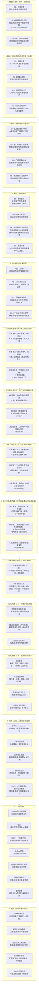

```mermaid

flowchart TB

%% 说明：每一行是一个“时间片/里程碑段”，同一行内（LR）表示并行推进

subgraph R1["0. 售前：线索→初筛→验收口径"]
direction LR
R1a["S1-1 线索澄清<br/>行业/仓库/痛点/目标/干系人"]
R1b["S1-2 数据请求与初筛<br/>托盘/箱规/峰值/平面图/系统清单<br/>Go/No-Go + 风险初版"]
R1c["S1-3 验收口径&KPI基线<br/>吞吐/成功率/可用率/恢复时间/取证"]
end

subgraph R2["0. 售前：现场调研&合规预审（前置）"]
direction LR
R2a["S2-1 调研准备<br/>Checklist/人员工具/拍照权限"]
R2b["S2-2 测量&动线<br/>层高/立柱/巷道/地面/瓶颈"]
R2c["S2-3 机房/网络/电力<br/>UPS/VLAN/防火墙/远程维护"]
R2d["S2-4 日本合规预审<br/>消防/避难动线/噪音/作业许可/安全要求"]
end

subgraph R3["0. 售前：方案深化&边界冻结"]
direction LR
R3a["S3-1 方案分解+RACI<br/>A硬件/B施工/C软件/D测试验收"]
R3b["S3-2 接口&数据口径草案<br/>托盘ID/库位/任务/状态码/幂等重试"]
R3c["S3-3 产能测算&比选<br/>设备/车数/节拍 成本/周期/风险/ROI"]
R3d["S3-4 施工窗口&运营影响<br/>分区/夜间/停机窗口/临时流程"]
end

subgraph R4["0. 售前：商务&签约"]
direction LR
R4a["S4-1 报价拆分<br/>硬件/施工/软件/服务<br/>验收/付款/SLA/维保"]
R4b["S4-2 PoC（可选）<br/>接口/定位/吞吐/异常恢复"]
R4c["S4-3 合同拆分&资质风险<br/>施工由日本本地公司承接<br/>跨方问题判定&保险/保修边界"]
R4d["S5-1 启动准备<br/>PM到位/例会/变更流程/里程碑V1/上线窗口"]
end

R1 --> R2 --> R3 --> R4

subgraph R5["1. 交付启动（总体管理）"]
direction LR
R5a["P1-1 Kickoff<br/>目标/边界/风险/里程碑对齐"]
R5b["P1-2 WBS并行计划<br/>A/B/C/D依赖+关键路径（周粒度）"]
R5c["P1-3 变更&版本管理<br/>接口版本/发布节奏/缺陷分级&SLA"]
R5d["P1-4 文档/语言/协作规范<br/>模板/命名/台账/权限/可追溯"]
end
R4 --> R5

subgraph R6["2. 并行实施-第一段（能立刻启动的）"]
direction LR
A6["A线 硬件：技术澄清→规格冻结<br/>+ BOM&备件策略→BOM冻结"]
B6["B线 施工：施工方准入→范围确认<br/>+ 施工设计启动（电力/网络/安全）"]
C6["C线 服务器：规格确认/采购准备<br/>+ 环境分层规划（DEV/UAT/PROD）"]
end
R5 --> R6

subgraph R7["2. 并行实施-第二段（生产/设计/基础环境）"]
direction LR
A7["A线 硬件：PO/合同&交期锁定<br/>+ 生产跟踪&质量检验"]
B7["B线 施工：施工图评审<br/>+ 合规/申报&安全计划（KY/JSA）"]
C7["C线 服务器：OS/DB/中间件安装&加固<br/>（安全基线）"]
end
R6 --> R7

subgraph R8["2. 并行实施-第三段（FAT/开工/网络）"]
direction LR
A8["A线 硬件：FAT（关键功能/安全互锁/通信）<br/>+ 包装/出货/报关资料"]
B8["B线 施工：入场安全教育/作业许可<br/>+ 现场准备（划线/临设/隔离）"]
C8["C线 服务器：网络/VLAN/防火墙/远程维护<br/>+ NTP时间同步"]
end
R7 --> R8

subgraph R9["2. 并行实施-第四段（到货/安装通电/可运维底座）"]
direction LR
A9["A线 硬件：运输保险&关键件备援<br/>+ 国际运输/清关→到场<br/>+ 日本收货&IQC"]
B9["B线 施工：机械安装（轨道/升降机/结构）<br/>+ 配电/布线/网络<br/>+ 电气点检（绝缘/接地）"]
C9["C线 服务器：监控/备份/恢复演练<br/>（可运维底座）"]
end
R8 --> R9

subgraph R10["3. 设备侧软件并行（厂商/车系统）"]
direction LR
C31["3.1 轨道/升降机控制（厂商）<br/>I/O点表→PLC参数→单机动作→通信稳定"]
C32["3.2 四向车系统<br/>地图模型→定位校准→车队调度→单体任务→小规模吞吐"]
end
R9 --> R10

subgraph R11["4. 集成系统（3.4）-规格&可观测性"]
direction LR
I1["任务模型/状态机设计<br/>入库/出库/移库/补货/异常分类"]
I2["接口规格固化（API/消息）<br/>幂等键/重放机制→版本冻结V1"]
I3["监控与可观测性<br/>指标/日志/告警/值班机制"]
end
R10 --> R11

subgraph R12["4. 集成系统（3.4）-联调&E2E闭环"]
direction LR
I4["分段联调<br/>集成↔控制 → 集成↔四向车 →（如有）上层系统"]
I5["E2E最小闭环<br/>单托盘：入库→上架→出库（可重复）"]
I6["异常库&人工介入<br/>权限/审计/回退SOP"]
I7["对账与补偿机制<br/>日终/异常对账；丢单防护"]
end
R11 --> R12

subgraph R13["5. 测试（D线：上线前必须过的）"]
direction LR
T0["SAT/Commissioning<br/>机械/电气/安全/通信底座确认"]
T1["系统联调测试<br/>功能覆盖 + 幂等重试验证"]
T2["异常恢复测试<br/>断网/断电/急停/报警 + 账实一致"]
T3["性能&稳定性<br/>吞吐压测 + 72h稳定性（建议）"]
T4["UAT + ORR运营就绪<br/>抽样/记录模板<br/>值班/备件/应急/告警/备份恢复"]
end
R12 --> R13

subgraph R14["6. 上线&验收"]
direction LR
G0["SOP/岗位变更管理<br/>新流程/岗位职责发布"]
G1["培训<br/>操作/管理员/维护 + 演练"]
G2["试运行（小流量/并行）<br/>日报+问题闭环+参数微调"]
G3["Go-Live切换<br/>上线监控+应急待命"]
G4["Hypercare驻场 2~4周<br/>问题收敛+知识转移"]
G5["文档&运维移交<br/>配置/版本/备份恢复/手册"]
G6["最终验收<br/>结项复盘+遗留项+保修期计划"]
end
R13 --> R14

subgraph R15["7. 售后（运维与客户成功）"]
direction LR
S1["工单&SLA运行<br/>响应/恢复/升级路径 + 月度复盘"]
S2["预防性维护&备件<br/>点检/更换/库存/年度保养"]
S3["安全/合规定期点检<br/>联锁/急停/围栏/SOP执行"]
S4["持续优化/扩容<br/>扩车/扩层/扩仓/新增接口 + ROI复盘"]
S5["QBR/续约/转介绍<br/>季度业务回顾与长期合作"]
end
R14 --> R15

```
