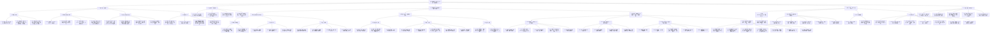

```mermaid

flowchart TB
ROOT["智能仓储自动化项目（全流程一体树状图）"]

%% =========================
%% 1) 售前（含方案准备）
%% =========================
ROOT --> PRE["① 售前（含方案准备）"]
PRE --> PRE1["1.1 线索与初筛"]
PRE1 --> PRE1A["S1-1 线索澄清：行业/仓库类型/痛点/目标/干系人"]
PRE1 --> PRE1B["S1-2 数据请求与初筛：托盘/箱规、峰值、平面图、现有系统清单、风险初版"]
PRE1 --> PRE1C["S1-3 验收口径与KPI基线：吞吐/成功率/可用率/恢复时间/取证口径（初稿）"]

PRE --> PRE2["1.2 现场调研与合规预审"]
PRE2 --> PRE2A["S2-1 调研准备：Checklist、人员工具、拍照权限"]
PRE2 --> PRE2B["S2-2 测量与动线：层高/立柱/巷道/地面、瓶颈与异常点"]
PRE2 --> PRE2C["S2-3 机房/网络/电力：UPS、VLAN、防火墙、远程维护条件"]
PRE2 --> PRE2D["S2-4 日本合规预审：消防/避难动线/噪音/作业许可/安全围栏与急停要求"]

PRE --> PRE3["1.3 方案深化与边界冻结"]
PRE3 --> PRE3A["S3-1 方案分解+RACI：A硬件采购/B日本施工/C软件(3.1/3.2/3.3/3.4)/D测试验收"]
PRE3 --> PRE3B["S3-2 接口与数据口径草案：托盘ID/库位编码/任务类型/状态码/幂等重试原则"]
PRE3 --> PRE3C["S3-3 产能测算与比选：设备数量/车数/节拍、成本/周期/风险/ROI"]
PRE3 --> PRE3D["S3-4 施工窗口与运营影响：分区/夜间/停机窗口、临时流程"]

PRE --> PRE4["1.4 商务与签约"]
PRE4 --> PRE4A["S4-1 报价拆分：硬件/施工/软件/服务；验收指标、付款节点、SLA/维保"]
PRE4 --> PRE4B["S4-2 PoC（可选）：接口/定位精度/吞吐/异常恢复"]
PRE4 --> PRE4C["S4-3 合同拆分与资质风险：日本施工由本地公司承接；跨方问题判定与保险/保修边界"]
PRE4 --> PRE4D["S5-1 启动准备：双方PM、例会机制、变更流程、里程碑V1、上线窗口"]

%% =========================
%% 2) 交付启动（总体管理）
%% =========================
ROOT --> DELI["② 交付启动（总体管理）"]
DELI --> DELI1["P1-1 Kickoff（三方/四方）：目标/边界/风险/里程碑对齐"]
DELI --> DELI2["P1-2 WBS并行计划：A/B/C/D依赖关系与关键路径（周粒度）"]
DELI --> DELI3["P1-3 变更与版本管理：接口版本、发布节奏、缺陷分级与SLA"]
DELI --> DELI4["P1-4 文档/语言/协作规范：模板、命名、台账、权限、可追溯"]

%% =========================
%% 3) A/B/C 主线并行实施
%% =========================
ROOT --> PAR["③ 并行实施主线（A硬件 / B施工 / C软件）"]

%% A 硬件采购（国内）
PAR --> AHW["A线：硬件采购（国内厂商）"]
AHW --> AHW0["A0 技术与物料冻结"]
AHW0 --> AHW01["A0-1 技术澄清：参数/接口/供电/安装条件/交期 → 技术规格冻结"]
AHW0 --> AHW02["A0-2 BOM与备件策略：主设备/辅材/安全件/易损件 → BOM冻结"]
AHW --> AHW1["A1 生产与FAT"]
AHW1 --> AHW11["A1-1 PO/合同与交期锁定：质检要求、FAT计划"]
AHW1 --> AHW12["A1-2 生产跟踪与质量检验：周报、偏差纠正"]
AHW1 --> AHW21["A2-1 FAT：关键功能/安全互锁/通信测试 → FAT通过"]
AHW --> AHW2["A2 出货与跨境"]
AHW2 --> AHW22["A2-2 包装/出货/报关资料：装箱单/原产地/说明书/标识"]
AHW2 --> AHW23["A2-3 运输保险与关键件备援：延期/损坏应急预案"]
AHW2 --> AHW31["A3-1 运输与清关：到港节点管理"]
AHW2 --> AHW32["A3-2 日本收货与IQC：开箱点检/索赔/补货计划"]

%% B 施工/安装（日本）
PAR --> BCON["B线：施工/安装（日本本地合作）"]
BCON --> BCON0["B0 施工设计与合规"]
BCON0 --> BCON01["B0-1 施工方准入：资质/保险/安全负责人/施工范围"]
BCON0 --> BCON02["B0-2 施工设计：配电/布线/网络点位/围栏/急停/联锁 → 图纸评审"]
BCON0 --> BCON03["B0-3 合规/申报与安全计划：消防/许可/KY/JSA"]
BCON --> BCON1["B1 施工与安装"]
BCON1 --> BCON10["B1-0 入场安全教育/作业许可：吊装/高空/动火管理"]
BCON1 --> BCON11["B1-1 现场准备：划线/堆放/临设/隔离警示"]
BCON1 --> BCON12["B1-2 机械安装：轨道/升降机/结构安装、锚固、水平校验"]
BCON1 --> BCON13["B1-3 配电/布线/网络：控制柜/传感器/急停、点位接入"]
BCON1 --> BCON14["B1-4 电气点检：绝缘/接地/漏电保护 → 可安全通电"]
BCON --> BCON2["B2 安全与交接"]
BCON2 --> BCON21["B2-1 安全联锁验证：急停/光栅/门禁/围栏联锁 → 安全验收"]
BCON2 --> BCON22["B2-2 竣工资料与交接：as-built/点位表/材料清单 → 交接调试"]

%% C 软件（3.3/3.1/3.2/3.4）
PAR --> CSW["C线：软件（本地部署 + 控制配置 + 四向车 + 集成系统）"]

CSW --> C33["C3.3 本地服务器（客户仓库本地部署）"]
C33 --> C331["C1-1 服务器规格确认/采购准备 → 服务器就绪"]
C33 --> C331a["C1-1a 环境分层规划：DEV/UAT/PROD、权限、发布流程"]
C33 --> C332["C1-2 OS/DB/中间件安装与加固 → 安全基线"]
C33 --> C333["C1-3 网络/VLAN/防火墙/远程维护 + NTP → 可连通可维护"]
C33 --> C334["C1-4 监控/备份/恢复演练 → 可恢复可运维"]

CSW --> C31["C3.1 轨道/升降机控制（厂商配置调试）"]
C31 --> C311["C2-1 I/O点表与信号映射 → 点表冻结"]
C31 --> C312["C2-2 PLC/控制参数配置：限位/校准/时序"]
C31 --> C313["C2-3 单机动作测试：急停/断电恢复 → 稳定可重复"]
C31 --> C314["C2-4 通信联通测试：心跳/超时/重连 → 断线可恢复"]

CSW --> C32["C3.2 四向车系统（控制四向车搬运托盘）"]
C32 --> C321["C3-1 地图/巷道/库位模型 → 地图评审"]
C32 --> C322["C3-2 定位与校准 → 定位精度达标"]
C32 --> C323["C3-3 车队配置与调度参数：避障/让行/充电/回库 → 调度稳定"]
C32 --> C324["C3-4 单体任务测试：异常处理 → 成功率达标"]
C32 --> C325["C3-5 小规模吞吐验证 → 吞吐满足预期"]

CSW --> C34["C3.4 集成系统（整合轨道升降机 + 四向车，完成自动化）"]
C34 --> C341["C4-1 任务模型/状态机：入库/出库/移库/补货/回收；异常分类"]
C34 --> C342["C4-2 接口规格固化：API/消息、幂等键、重放机制 → 版本冻结V1"]
C34 --> C343["C4-3 监控与可观测性：吞吐/成功率/队列/故障、告警与值班"]
C34 --> C344["C4-4 分段联调：集成↔控制 → 集成↔四向车 → 集成↔上层系统(如有)"]
C34 --> C345["C4-5 E2E最小闭环：单托盘入库→上架→出库（可重复）"]
C34 --> C346["C4-6 异常库与人工介入：权限/审计/补救流程"]
C34 --> C347["C4-7 对账与补偿机制：日终对账/异常对账、丢单防护"]

%% =========================
%% 4) D线：测试→上线→验收
%% =========================
ROOT --> DALL["④ D线：测试 → 上线 → 验收"]
DALL --> D1["4.1 现场SAT/Commissioning（打稳底座）"]
D1 --> D1A["T0-1 SAT：机械/电气/安全联锁/通信基础确认 + 整改闭环"]

DALL --> D2["4.2 系统测试（功能/异常/性能/稳定性）"]
D2 --> D2A["T1-1 测试计划与用例：范围/数据/通过标准"]
D2 --> D2B["T1-2 系统级联调测试：功能覆盖 + 幂等重试验证"]
D2 --> D2C["T1-3 异常与恢复：断网/断电/急停/报警 + 账实一致"]
D2 --> D2D["T2-1 性能吞吐压测：峰值/队列/等待时间"]
D2 --> D2E["T2-2 72h稳定性（建议）：漂移/累计误差观察"]

DALL --> D3["4.3 UAT与运营就绪"]
D3 --> D3A["T3-1 UAT：客户参与验收 + 抽样/记录模板"]
D3 --> D3B["T3-2 ORR运营准备评审：值班/备件/应急/权限/告警/备份恢复"]

DALL --> D4["4.4 上线与验收"]
D4 --> D4A["G0-0 SOP/岗位变更：新流程与岗位职责发布 + 培训计划"]
D4 --> D4B["G0-1 培训：操作/管理员/维护 + 演练异常恢复"]
D4 --> D4C["G0-2 试运行：并行/小流量、日报、问题闭环、参数微调"]
D4 --> D4D["G1-1 Go-Live：切换执行、监控、应急待命"]
D4 --> D4E["G1-2 Hypercare：2~4周驻场支持、知识转移、问题收敛"]
D4 --> D4F["G2-1 文档与运维移交：操作/运维/配置/版本/备份恢复"]
D4 --> D4G["G2-2 最终验收：结项复盘、遗留项与保修期计划"]

%% =========================
%% 5) 售后（运维与客户成功）
%% =========================
ROOT --> AFT["⑤ 售后（运维与客户成功）"]
AFT --> AFT1["AFT-1 工单与SLA：响应/恢复/升级路径 + 月度复盘"]
AFT --> AFT2["AFT-2 预防性维护与备件：点检/更换/库存/年度保养"]
AFT --> AFT3["AFT-3 安全/合规定期点检：联锁/急停/围栏/SOP执行 + 整改闭环"]
AFT --> AFT4["AFT-4 持续优化/扩容：扩车/扩层/扩仓/新增接口 + ROI复盘"]
AFT --> AFT5["AFT-5 QBR/续约与转介绍：季度业务回顾与长期合作"]
```
